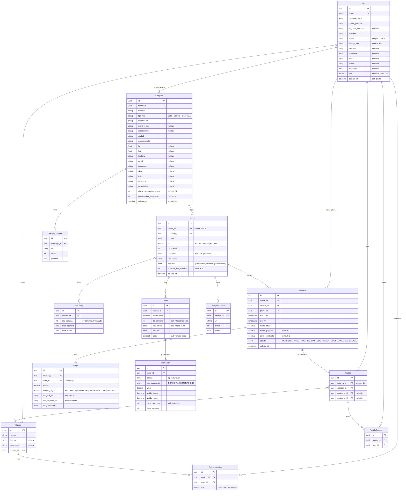

:::caution[Documento del modelo lógico — pendiente de actualizar]
Este documento describe el modelo original (Prisma) y el **contrato de la API**, que se mantuvo igual. El schema físico actual es el de Drizzle y la fuente de verdad es `web/packages/db/src/schema/`. Diferencias principales, que `src/lib/db-mappers.ts` traduce en la API:

| API / este documento | Base de datos (Drizzle) |
|---|---|
| tabla `users` | `usuarios` |
| `primer_nombre` + `segundo_nombre`, `apellidos` | `nombre` (ambos nombres), `apellido` |
| `role` | `rol` (enum `rol_usuario`, incluye `ADMIN`, sin acceso a la app) |
| tipo `F5` … `F11` | enum `tipo_cancha`: `FUTBOL_5` … `FUTBOL_11` |
| `lat` / `lng` (float) | `latitud` / `longitud` (decimal) |
| `plazo_cancelacion_horas`, `penalizacion_porcentaje` | `politica_cancelacion_horas`, `politica_cancelacion_penalizacion` |
| tabla `complejo_imagenes` | `imagenes_complejos` |
| notificación `RESERVA_PAGO_PARCIAL` | `PAGO_PARCIAL_RECIBIDO` |
| — | `complejos.direccion` (texto formateado) + `slug`; estado `EXPIRADA` disponible |
| — | `complejos.zona_horaria` (IANA, default `America/Bogota`) — ver [Zonas horarias](/guides/timezone) |
:::

## Convenciones

- **Nombres en español** para entidades de negocio (`cancha`, `reserva`, `pago`)
- **Nombres en inglés** para conceptos técnicos/universales (`user`, `tenant`, `role`)
- **IDs**: UUID v4 en todas las tablas (mejor que autoincrement para escalar horizontalmente y seguridad)
- **Timestamps**: `created_at` y `updated_at` en TODAS las tablas
- **Soft delete**: `deleted_at` en entidades principales (cancha, reserva) — no se borran físicamente
- **`tenant_id`**: presente en toda tabla que pertenezca a un dueño

## Multi-tenancy

Cada tabla de negocio incluye `tenant_id` que referencia al `user.id` del dueño. El middleware de API inyecta el `tenant_id` del JWT en cada query. No hay forma de que un dueño vea datos de otro — el filtro es forzado a nivel de capa de datos, no de aplicación.

```
┌─────────────────────────────────────────────────┐
│  SELECT * FROM cancha WHERE tenant_id = $1      │
│                         ↑                        │
│                   extraído del JWT               │
└─────────────────────────────────────────────────┘
```

## Diagrama entidad-relación



## Tablas en detalle

### `users`

Tabla única para dueños y jugadores. El campo `role` determina los permisos.

| Columna | Tipo | Notas |
|---|---|---|
| `id` | `UUID` PK | Generado por Prisma (`@default(uuid())`) |
| `email` | `VARCHAR(255)` UNIQUE | Login + notificaciones |
| `password_hash` | `VARCHAR(255)` | bcrypt, nunca el password plano |
| `primer_nombre` | `VARCHAR(50)` | Primer nombre |
| `segundo_nombre` | `VARCHAR(50)` nullable | Segundo nombre (opcional) |
| `apellidos` | `VARCHAR(100)` | Apellidos completos |
| `apodo` | `VARCHAR(30)` UNIQUE nullable | Handle único en el sistema — futuras menciones, puntuaciones, transacciones |
| `codigo_pais` | `VARCHAR(5) DEFAULT '+57'` | Código de país para teléfono |
| `telefono` | `VARCHAR(15)` nullable | Número sin código de país |
| `instagram` | `VARCHAR(30)` nullable | Username de Instagram |
| `tiktok` | `VARCHAR(30)` nullable | Username de TikTok |
| `twitter` | `VARCHAR(30)` nullable | Username de Twitter/X |
| `facebook` | `VARCHAR(50)` nullable | Username de Facebook |
| `role` | `ENUM('OWNER', 'PLAYER')` | Un usuario puede tener un solo rol en MVP |
| `deleted_at` | `TIMESTAMPTZ` | Soft delete |

**Decisiones**:
- Nombre separado en `primer_nombre`, `segundo_nombre`, `apellidos`: permite búsquedas por cualquier campo y formato flexible en UI.
- `apodo` como handle único: será usado para menciones (`@carlitosgomez`), puntuaciones, y como identificador público en el sistema.
- `codigo_pais` por defecto `+57` (Colombia): target primario, extensible a otros países.
- UUID en vez de autoincrement: no expone cuántos usuarios hay, imposible iterar IDs.

### `complejos`

Agrupa canchas bajo un mismo espacio físico. Un dueño puede tener múltiples complejos.

| Columna | Tipo | Notas |
|---|---|---|
| `id` | `UUID` PK | |
| `tenant_id` | `UUID` FK → `users.id` | El dueño |
| `nombre` | `VARCHAR(100)` | "Fútbol Center El Campito" |
| `tipo_via` | `VARCHAR(20) DEFAULT 'Calle'` | Calle, Carrera, Diagonal, Transversal, Avenida, Autopista |
| `numero_via` | `VARCHAR(10)` | Número principal (ej: "123") |
| `numero_sec` | `VARCHAR(10)` nullable | Número secundario después del # (ej: "45-67") |
| `complemento` | `VARCHAR(100)` nullable | Apto, Local, Interior, etc. |
| `ciudad` | `VARCHAR(100)` | |
| `departamento` | `VARCHAR(100)` | |
| `lat` | `FLOAT` nullable | Coordenadas para mapa |
| `lng` | `FLOAT` nullable | |
| `telefono` | `VARCHAR(20)` nullable | |
| `email` | `VARCHAR(255)` nullable | |
| `instagram` | `VARCHAR(30)` nullable | |
| `tiktok` | `VARCHAR(30)` nullable | |
| `twitter` | `VARCHAR(30)` nullable | |
| `facebook` | `VARCHAR(50)` nullable | |
| `descripcion` | `TEXT` nullable | |
| `plazo_cancelacion_horas` | `INT DEFAULT 24` | Horas mínimas antes del slot para cancelar sin penalización |
| `penalizacion_porcentaje` | `INT DEFAULT 0` | % de penalización si cancela fuera del plazo (0-100) |
| `deleted_at` | `TIMESTAMPTZ` | |

**Decisiones**:
- Dirección fragmentada al estilo colombiano (`tipo_via + numero_via + # + complemento`) para geocoding preciso con Nominatim.
- Redes sociales por complejo: cada espacio deportivo maneja sus propias cuentas.
- `lat`/`lng` como FLOAT para uso directo en mapas (Google Maps, Waze). La columna `ubicacion` (PostGIS geometry) queda para futuras búsquedas geoespaciales.
- `plazo_cancelacion_horas` + `penalizacion_porcentaje`: políticas de cancelación configurables por complejo. Si el jugador cancela dentro del plazo, reembolso 100%. Fuera del plazo, se descuenta la penalización.

### `complejo_imagenes`

| Columna | Tipo | Notas |
|---|---|---|
| `id` | `UUID` PK | |
| `complejo_id` | `UUID` FK → `complejos.id` | |
| `url` | `VARCHAR(500)` | URL pública de Supabase Storage |
| `orden` | `INT DEFAULT 0` | Orden en la galería |
| `principal` | `BOOLEAN DEFAULT false` | Imagen principal del complejo |

### `canchas`

El corazón del negocio. Cada dueño configura sus espacios.

| Columna | Tipo | Notas |
|---|---|---|
| `id` | `UUID` PK | |
| `tenant_id` | `UUID` FK → `users.id` | El dueño |
| `complejo_id` | `UUID` FK → `complejos.id` | Complejo al que pertenece |
| `nombre` | `VARCHAR(100)` | "Cancha Principal", "Fútbol 7 Techada" |
| `tipo` | `ENUM('F5','F6','F7','F8','F9','F11')` | Cantidad de jugadores |
| `capacidad` | `INT` | Jugadores totales (ej: 10 para F5, 14 para F7) |
| `ubicacion` | `GEOMETRY(POINT)` | Lat/Lng para PostGIS. Índice espacial. |
| `descripcion` | `TEXT` | Descripción libre |
| `servicios` | `JSONB` | `["vestidores", "cafeteria", "parqueadero"]` |
| `duracion_slot_minutos` | `INT DEFAULT 60` | Cuánto dura cada bloque de reserva |
| `deleted_at` | `TIMESTAMPTZ` | |

**Decisiones**:
- `tipo` como ENUM, no como string libre. Estandariza búsquedas y filtros.
- `servicios` como JSONB, no como tabla relacionada. Son pocos datos, poca variación, y se consultan siempre junto a la cancha. No justifica un JOIN.
- `duracion_slot_minutos` define el bloque base (30, 60, 90, 120). El dueño lo elige por cancha.

### `slot_configs`

Define los días y horarios en que una cancha está disponible.

| Columna | Tipo | Notas |
|---|---|---|
| `id` | `UUID` PK | |
| `cancha_id` | `UUID` FK → `canchas.id` | |
| `dia_semana` | `INT` | 0=Domingo, 1=Lunes... 6=Sábado |
| `hora_apertura` | `TIME` | Ej: `'08:00'` |
| `hora_cierre` | `TIME` | Ej: `'23:00'` |

**Ejemplo**: Cancha F5 disponible Lunes a Viernes 8:00-23:00 y Sábados 9:00-20:00 → 6 registros en esta tabla.

**Decisión**: No usamos `DATERANGE` ni `TSRANGE` para los slots porque los horarios son semanales, no por fecha específica. La disponibilidad real en una fecha se calcula: `slot_configs` − `reservas` en ese rango.

### `tarifas`

Motor de precios dinámicos. Una cancha puede tener múltiples tarifas que compiten por "quién aplica".

| Columna | Tipo | Notas |
|---|---|---|
| `id` | `UUID` PK | |
| `cancha_id` | `UUID` FK → `canchas.id` | |
| `precio_base` | `DECIMAL(10,2)` | Precio por slot (ej: 15000) |
| `dia_semana` | `INT` nullable | `null` = aplica todos los días |
| `hora_inicio` | `TIME` nullable | `null` = todo el día |
| `hora_fin` | `TIME` nullable | |
| `factor` | `DECIMAL(3,2) DEFAULT 1.0` | Multiplicador: 1.0=normal, 1.5=+50% |

**Lógica de resolución**: Cuando se calcula el precio de un slot, se busca la tarifa más específica que aplique:

```sql
-- Buscar tarifa que aplique para un día y hora específicos
SELECT * FROM tarifas
WHERE cancha_id = $1
  AND (dia_semana IS NULL OR dia_semana = $2)
  AND (hora_inicio IS NULL OR hora_inicio <= $3)
  AND (hora_fin IS NULL OR hora_fin >= $3)
ORDER BY
  dia_semana IS NOT NULL DESC,  -- prefiero específica sobre general
  hora_inicio IS NOT NULL DESC
LIMIT 1;
```

**Ejemplo de configuración**:

| precio_base | día | hora | factor | Significa |
|---|---|---|---|---|
| 15000 | null | null | 1.0 | Precio base default: $15.000 |
| 15000 | 5 (Vie) | 18:00-23:00 | 1.3 | Viernes noche: +30% |
| 15000 | 6 (Sáb) | null | 1.5 | Sábado todo el día: +50% |

### `reservas`

El evento central del sistema. Un jugador reserva una cancha en un slot específico.

| Columna | Tipo | Notas |
|---|---|---|
| `id` | `UUID` PK | |
| `tenant_id` | `UUID` FK → `users.id` | Dueño de la cancha |
| `cancha_id` | `UUID` FK → `canchas.id` | |
| `player_id` | `UUID` FK → `users.id` | Jugador que reserva |
| `slot_inicio` | `TIMESTAMPTZ` | Fecha y hora de inicio |
| `slot_fin` | `TIMESTAMPTZ` | Fecha y hora de fin |
| `monto_total` | `DECIMAL(10,2)` | Precio final aplicado (calculado al reservar) |
| `monto_pagado` | `DECIMAL(10,2) DEFAULT 0` | Suma de pagos aprobados |
| `saldo_pendiente` | `DECIMAL(10,2) DEFAULT 0` | `monto_total - monto_pagado` |
| `estado` | `ENUM('PENDIENTE_PAGO','PAGO_PARCIAL','CONFIRMADA','COMPLETADA','CANCELADA')` | |
| `deleted_at` | `TIMESTAMPTZ` | |

**Decisiones**:
- `monto_total` se calcula al momento de crear la reserva y se congela. Si el dueño cambia precios después, no afecta reservas existentes. Esto es importante para integridad financiera.
- `PENDIENTE_PAGO` tiene TTL: si no se paga en 15 minutos, se libera el slot.
- `PAGO_PARCIAL`: el jugador pagó al menos el 50% pero no el total. La reserva está asegurada pero debe completar el pago antes de jugar.
- `monto_pagado` y `saldo_pendiente` se actualizan con cada pago aprobado vía webhook.
- Jugadores con `saldo_pendiente > 0` en cualquier reserva no pueden crear nuevas reservas (bloqueo por saldo).
- `slot_inicio` y `slot_fin` validan contra `slot_configs` de la cancha.
- **Constraint UNIQUE**: No puede haber dos reservas confirmadas para la misma cancha con solapamiento de horario.

### `pagos`

Registro de transacciones de Mercado Pago. Una reserva puede tener **múltiples pagos** (pago parcial + saldo, pagos compartidos entre jugadores).

| Columna | Tipo | Notas |
|---|---|---|
| `id` | `UUID` PK | |
| `reserva_id` | `UUID` FK → `reservas.id` | |
| `user_id` | `UUID` FK → `users.id` | Quien realizó el pago (puede ser distinto al player_id si es pago compartido) |
| `monto` | `DECIMAL(10,2)` | Monto de este pago específico |
| `estado_pago` | `ENUM('PENDIENTE','APROBADO','RECHAZADO','REEMBOLSADO')` | |
| `mp_split_id` | `VARCHAR(255)` nullable | ID del split en MercadoPago |
| `mp_payment_id` | `VARCHAR(255)` nullable | ID del pago (cuando se completa) |
| `mp_metadata` | `JSONB` nullable | Respuesta completa del webhook |

**Flujo**:
1. Jugador inicia reserva → `reserva.estado = PENDIENTE_PAGO`
2. Backend crea preference/split en MP → `pago.mp_split_id`
3. Jugador paga en MP → webhook actualiza `pago.estado_pago = APROBADO`
4. Backend actualiza `reserva.monto_pagado` y `reserva.saldo_pendiente`
5. Si pagó el 50-99% → `reserva.estado = PAGO_PARCIAL`
6. Si pagó el 100% → `reserva.estado = CONFIRMADA`

### `imagenes_canchas`

Galería de fotos de cada cancha. Almacenadas en Supabase Storage.

| Columna | Tipo | Notas |
|---|---|---|
| `id` | `UUID` PK | |
| `cancha_id` | `UUID` FK → `canchas.id` | |
| `url` | `VARCHAR(500)` | URL pública de Supabase Storage |
| `orden` | `INT` | Para ordenar en el carrusel |
| `principal` | `BOOL DEFAULT false` | Imagen de portada |

### `promociones`

Códigos de descuento vinculados a tarifas.

| Columna | Tipo | Notas |
|---|---|---|
| `id` | `UUID` PK | |
| `tarifa_id` | `UUID` FK → `tarifas.id` | Tarifa sobre la que aplica |
| `codigo` | `VARCHAR(50)` UNIQUE | `AMIGOS10`, `VERANO2026` |
| `tipo_descuento` | `ENUM('PORCENTAJE','MONTO_FIJO')` | |
| `valor` | `DECIMAL(10,2)` | 10 = 10% o $10.000 según tipo |
| `valido_desde` | `TIMESTAMPTZ` | |
| `valido_hasta` | `TIMESTAMPTZ` | |
| `usos_maximos` | `INT` nullable | `null` = ilimitado |
| `usos_actuales` | `INT DEFAULT 0` | |

### `partidos`

Un partido vincula una reserva con los jugadores y equipos que participan. Relación 1:1 con reserva.

| Columna | Tipo | Notas |
|---|---|---|
| `id` | `UUID` PK | |
| `reserva_id` | `UUID` UNIQUE FK → `reservas.id` | 1:1 — cada partido tiene exactamente una reserva |
| `creador_id` | `UUID` FK → `users.id` | Quien creó el partido |
| `equipo_a_id` | `UUID` FK → `equipos.id` nullable | Equipo local (opcional) |
| `equipo_b_id` | `UUID` FK → `equipos.id` nullable | Equipo visitante (opcional) |
| `created_at` | `TIMESTAMPTZ` | |

**Decisiones**:
- `reserva_id` UNIQUE: un partido siempre está vinculado a exactamente una reserva de cancha.
- Equipos opcionales: un partido puede existir sin equipos asignados (amistoso casual).
- Cualquier jugador invitado al partido puede pagar parte de la reserva (pagos compartidos).

### `partido_jugadores`

Jugadores invitados a un partido. Tabla pivote entre partidos y usuarios.

| Columna | Tipo | Notas |
|---|---|---|
| `id` | `UUID` PK | |
| `partido_id` | `UUID` FK → `partidos.id` | |
| `user_id` | `UUID` FK → `users.id` | |

**Constraint**: `UNIQUE(partido_id, user_id)` — un jugador no puede estar duplicado en el mismo partido.

### `equipos`

Grupos recurrentes de jugadores que juegan juntos.

| Columna | Tipo | Notas |
|---|---|---|
| `id` | `UUID` PK | |
| `nombre` | `VARCHAR(100)` | "Los Galácticos FC" |
| `foto_url` | `VARCHAR(500)` nullable | Logo o foto del equipo |
| `descripcion` | `TEXT` nullable | |
| `creador_id` | `UUID` FK → `users.id` | Quien creó el equipo |
| `created_at` | `TIMESTAMPTZ` | |
| `updated_at` | `TIMESTAMPTZ` | |

### `equipo_miembros`

Miembros de un equipo. Tabla pivote entre equipos y usuarios.

| Columna | Tipo | Notas |
|---|---|---|
| `id` | `UUID` PK | |
| `equipo_id` | `UUID` FK → `equipos.id` | |
| `user_id` | `UUID` FK → `users.id` | |
| `rol` | `VARCHAR(20) DEFAULT 'MIEMBRO'` | `CAPITAN` o `MIEMBRO` |

**Constraint**: `UNIQUE(equipo_id, user_id)` — un usuario no puede estar duplicado en el mismo equipo.

## Índices

```sql
-- Búsqueda geoespacial: "canchas cerca de mí"
CREATE INDEX idx_canchas_ubicacion ON canchas USING GIST (ubicacion);

-- Búsqueda de disponibilidad
CREATE INDEX idx_reservas_slot ON reservas (cancha_id, slot_inicio, slot_fin)
  WHERE estado IN ('PENDIENTE_PAGO', 'CONFIRMADA');

-- Filtro por tipo de cancha
CREATE INDEX idx_canchas_tipo ON canchas (tipo) WHERE deleted_at IS NULL;

-- Búsqueda de promociones por código
CREATE INDEX idx_promociones_codigo ON promociones (codigo)
  WHERE valido_hasta > NOW();

-- Tenant isolation (todas las queries lo usan)
CREATE INDEX idx_canchas_tenant ON canchas (tenant_id);
CREATE INDEX idx_reservas_tenant ON reservas (tenant_id);
```

## Decisiones de diseño explicadas

### ¿Por qué UUID y no autoincrement?

```typescript
// Con autoincrement, un atacante puede iterar:
GET /api/reservas/1
GET /api/reservas/2
GET /api/reservas/3  // esto expone datos de otros

// Con UUID:
GET /api/reservas/a1b2c3d4-...  // imposible adivinar

// Además, UUID permite generar IDs en el frontend
// sin esperar al INSERT (optimistic UI)
```

### ¿Por qué `monto_total` en reserva se congela?

Si el dueño cambia el precio de una cancha de $15.000 a $18.000, las reservas ya confirmadas a $15.000 no deberían verse afectadas. Guardamos el monto al momento de crear la reserva y no lo recalculamos.

### ¿Por qué `servicios` es JSONB y no tabla?

Los servicios de una cancha (`vestidores`, `cafeteria`) son:
- Pocos (5-10 máximo)
- Poco profundos (solo un nombre o ícono)
- Siempre se consultan junto con la cancha

Una tabla `servicios` con un JOIN es costo innecesario para este caso. Si en el futuro los servicios tienen precios, horarios o configuraciones propias, migramos a tabla. Por ahora JSONB.

### ¿Por qué `slot_configs` usa día de semana y no fechas concretas?

Los horarios de una cancha son patrones semanales ("Lunes a Viernes 8-23, Sábado 9-20"). Si usáramos fechas concretas (`slot_inicio TIMESTAMP`) tendríamos que generar registros infinitos hacia el futuro. En cambio, calculamos disponibilidad dinámicamente:

```
disponibilidad(semana) = slot_configs − reservas_confirmadas(semana)
```
