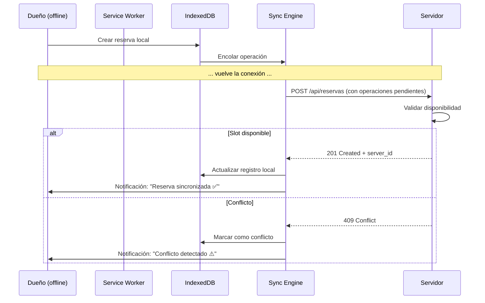

El sistema debe permitir que los dueños de canchas **sigan registrando reservas** aunque no tengan conexión a internet. Cuando la conexión se restablece, los datos se sincronizan automáticamente con el servidor.

## Componentes

### Service Worker

Cachea los assets estáticos (HTML, CSS, JS, fuentes) para que la app cargue sin conexión. Estrategia: **Cache First** para assets, **Network First** para API calls.

```typescript
// sw.ts — Service Worker
self.addEventListener("fetch", (event) => {
  const { request } = event;

  // API calls → siempre intentar red
  if (request.url.includes("/api/")) {
    event.respondWith(networkFirst(request));
    return;
  }

  // Assets → cache primero, red como fallback
  event.respondWith(cacheFirst(request));
});
```

### IndexedDB local (Dexie.js)

Base de datos en el navegador que espeja las tablas críticas del dueño:

| Tabla local | Equivalente servidor | Sincronización |
|---|---|---|
| `localReservas` | `reservas` | Bidireccional |
| `localCanchas` | `canchas` | Solo lectura (cache) |
| `localClientes` | `users` (rol PLAYER) | Solo lectura (cache) |
| `syncQueue` | — | Cola de operaciones pendientes |

### Sync Engine

Cuando el dueño crea/reserva offline:

1. Se guarda en `localReservas` con `sincronizada = false`
2. Se encola en `syncQueue` como operación pendiente
3. Al detectar conexión, el Sync Engine procesa la cola en orden FIFO
4. El servidor responde con el `id` real y `created_at` del servidor
5. Se actualiza el registro local con los datos del servidor

### Conflict Resolution

**Regla**: el timestamp del servidor gana.

```
Dueño offline crea reserva slot 18:00 → timestamp local 14:05
Jugador online reserva slot 18:00  → timestamp servidor 14:06

Resultado: GANA el jugador (14:06 > 14:05)
El dueño recibe notificación de conflicto al sincronizar.
```

### Detección de conectividad

```typescript
// Hook: useOnlineStatus
const isOnline = useOnlineStatus();

if (!isOnline) {
  // Dueño: puede seguir operando
  // Jugador: "El sistema está temporalmente sin conexión.
  //           Contactá al dueño por WhatsApp para reservar."
}
```

## Estados de UI

### Vista del dueño (offline)

- ✅ Puede ver sus canchas (datos cacheados)
- ✅ Puede crear reservas (cola local)
- ✅ Puede ver clientes frecuentes (datos cacheados)
- ⚠️ Banner amarillo: "Sin conexión — los cambios se sincronizarán al reconectar"
- ❌ No puede ver disponibilidad actualizada de otros jugadores

### Vista del jugador (offline)

- ❌ Bloqueado: vista de "Sin conexión"
- 📱 Mensaje: "El sistema no está disponible en este momento. Contactá al dueño por WhatsApp para reservar."
- 🔗 Link directo a WhatsApp del dueño

## Stack PWA

| Capa | Tecnología |
|---|---|
| Service Worker | `next-pwa` o manual con Workbox |
| IndexedDB | Dexie.js (API reactiva sobre IndexedDB) |
| Sincronización | Custom Sync Engine |
| Detección | `navigator.onLine` + `online`/`offline` events |
| Manifest | `manifest.json` + metadatos PWA |

## Secuencia de sincronización



## MVP vs Completo

| Feature | MVP (Fase 1) | Completo (Fase 1.1) |
|---|---|---|
| Service Worker + cache | ✅ | ✅ |
| Detección online/offline | ✅ | ✅ |
| Registro offline de reservas | ✅ | ✅ |
| Sincronización automática | ✅ (básica) | ✅ (con reintentos y backoff) |
| Conflict resolution manual | ✅ | — |
| Conflict resolution automática | — | ✅ |
| Soporte offline para edición | — | ✅ |
