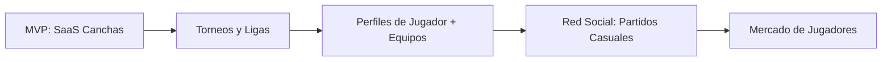

SFS es una plataforma SaaS multi-tenant que conecta dueños de canchas de fútbol con jugadores, resolviendo de forma integral el descubrimiento, la reserva y el pago de canchas en un solo sistema.

## El problema

Actualmente la mayoría de las canchas de fútbol gestionan sus reservas por **WhatsApp, llamadas telefónicas o de forma presencial**. No existe una herramienta unificada que:

- Permita a los dueños administrar sus canchas, horarios, precios y clientes
- Ofrezca a los jugadores descubrir y reservar canchas cercanas con disponibilidad en tiempo real
- Integre pagos para reducir fricción y eliminar no-shows
- Escale desde el club de barrio hasta cadenas de canchas a nivel nacional

## La solución

Una plataforma donde **cada dueño ve y administra exclusivamente los datos de su negocio** (multi-tenant), y cada jugador tiene un perfil personal para buscar, reservar y pagar.

### Roles del sistema

| Rol | Capacidades |
|---|---|
| **Dueño** (owner) | CRUD de canchas, configuración de slots y horarios, precios dinámicos, reservas manuales, reportes, gestión de clientes |
| **Jugador** (player) | Registro, búsqueda de canchas por ubicación y disponibilidad, reserva, pago, historial |

### Seguridad

Para prevenir estafas o mal uso del sistema, la persona que realiza la reserva debe **presentarse físicamente** al solicitar acceso a la cancha. Este disclaimer será visible durante el proceso de reserva.

## Principios de arquitectura

### Multi-tenancy por columna discriminante

Cada tabla del sistema incluye `tenant_id`. Cada query se filtra por el tenant del dueño autenticado. Estrategia elegida para el MVP:

- ✅ Simple de implementar y mantener
- ✅ Escala bien en etapas tempranas (cientos de tenants)
- ✅ Fácil de migrar a schema-per-tenant si un cliente lo requiere

### Precios dinámicos (full)

El sistema soportará un motor de reglas de precios configurable por el dueño:

- **Precio base** por cancha
- **Tarifas por franja horaria** (día de la semana + rango horario)
- **Recargos por día especial** (fines de semana, feriados)
- **Descuentos por volumen** (ej: 3+ horas → 15% descuento)
- **Códigos de promoción**

## Stack tecnológico

| Capa | Tecnología | Justificación |
|---|---|---|
| **Docs** | Astro + Starlight | Documentación del proyecto |
| **Frontend** | Next.js (App Router) | SSR/SSG para SEO, Server Components, API Routes integradas |
| **Backend** | Node.js + TypeScript | Mismo lenguaje que frontend, ecosistema enorme, ideal fullstack |
| **Base de datos** | PostgreSQL + PostGIS | Relacional robusta, geolocalización nativa, JSONB para configs dinámicas |
| **ORM** | Prisma | Schema declarativo (pedagógico), migraciones automáticas, type-safe |
| **Pagos** | Mercado Pago | Dominancia en Latinoamérica, cuotas, billetera digital |
| **Auth** | Manual (bcrypt + JWT) | Para aprendizaje profundo de autenticación; refresh tokens, rate limiting |
| **Monorepo** | pnpm workspaces | Gestión de packages en un solo repo (docs, frontend, backend) |
| **Hosting** | Supabase (DB + Storage) + Vercel (Next.js + API serverless) | Supabase incluye PostGIS y storage; Vercel es nativo para Next.js |
| **Auth** | Manual (bcrypt + JWT) → Supabase Auth (post-MVP) | Aprender fundamentos; migrar a managed cuando esté dominado |
| **Testing** | Unit + Integration (Vitest + Supertest) | Cobertura de lógica crítica y flujos principales |
| **Almacenamiento** | Supabase Storage | Fotos de canchas, assets |

## Roadmap

### MVP (Fase 1)

Gestión de canchas: dueños configuran sus espacios, jugadores descubren, reservan y pagan.

### Fase 2+

- Torneos tipo liga y copa con árbitros certificados por la comunidad
- Perfiles de jugador con estadísticas (goles, faltas, progreso)
- Equipos de fútbol gestionados por jugadores
- Partidos casuales con cupos abiertos
- Sistema de reputación y rating de jugadores
